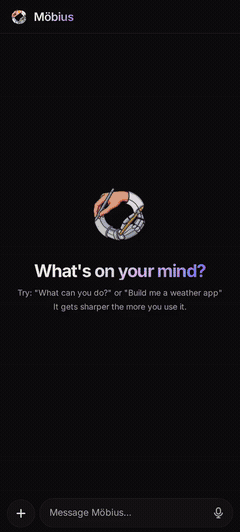
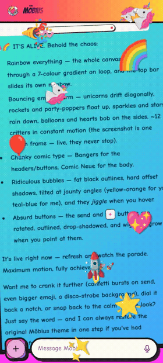
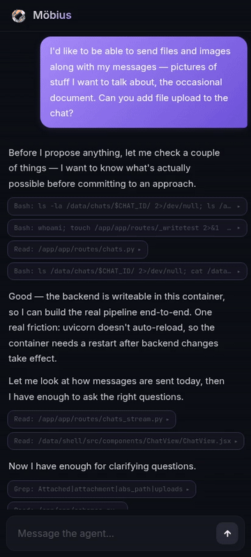

<p align="center">
  
</p>

<h1 align="center">Möbius</h1>

<p align="center">
  A personalized AI agent you self-host. It adapts to what you do and how you want it to look, and gets sharper the more you use it.
</p>

<p align="center">
  <a href="LICENSE"></a>
  <a href="https://hub.docker.com"></a>
  <a href="#get-started"></a>
</p>

<p align="center">
  <a href="#what-is-möbius">What is it?</a> &middot;
  <a href="#what-can-you-build">What can you build?</a> &middot;
  <a href="#what-can-you-change">What can you change?</a> &middot;
  <a href="#an-app-store-and-an-operating-system">App store + OS</a> &middot;
  <a href="#built-by-the-agent">Built by the agent</a> &middot;
  <a href="#how-it-improves-itself">How it improves itself</a> &middot;
  <a href="#get-started">Get started</a>
</p>

<p align="center">
  <a href="https://hamzamerzic.info/blog/2026/mobius-an-app-that-builds-itself/">An agent that adapts to you</a> &middot;
  <a href="https://hamzamerzic.info/blog/2026/the-self-improvement-harness/">The self-improvement harness</a> &middot;
  <a href="https://hamzamerzic.info/blog/2026/the-agent-is-the-kernel/">The agent is the kernel</a>
</p>

---

## What is Möbius?

Most software asks you to adapt to it. AI assistants tend to make this worse with time: context drifts, preferences leak between tasks, memory accumulates in the wrong places, sessions feel less coherent the more you use them. Möbius is built around the opposite idea. It improves the more you interact with it.

Möbius is a personalized AI agent you self-host. A chat on one side, a canvas on the other. You describe what you want, and the coding agent inside builds it, a small piece of software that lands next to the chat, runs in your browser, and is yours to keep.

The agent isn't limited to apps. It can change the interface itself: the theme, the layout, the features in the shell. It edits the source and rebuilds live. Some changes appear instantly, others take a few seconds. The agent runs on Codex (free or paid ChatGPT plan) or Claude Code (any paid plan), both via OAuth, no API key needed. Codex includes image generation out of the box; on Claude Code you can plug in a Gemini API key for image generation if you want it, but it's optional.

It installs on your phone like a native app (Android and iOS). Because it runs on *your* server, your data stays yours.

Check out [Get Started](#get-started) for one-click setup.

---

## What can you build?

Most software is built once, for everyone. Möbius builds what you describe, in front of you. Over time it picks up on your preferences and interests to be more helpful, and your data stays on a server you control.

Some things we've built:

- **News aggregator:** runs on a schedule, searches the web, filters stories based on preferences that evolve over time
- **Stock market dashboard:** for a local exchange with no public API; the agent figured out how to scrape it
- **Finance tool:** upload statements, categorize spending, compute taxes from your phone
- **Period tracker:** built around how you actually want to use one
- **Learning companion:** uses AI to build a curriculum around any topic, with spaced repetition that adjusts as you improve
- **Drum machine:** turns voice samples into beats

Your health data, your finances, your habits, all private by default.

When you ask for something, the agent builds it as a small app right inside the chat, without reloading the page. Each app can store data, run on a schedule, fetch from the web, and use AI on its own. There's also a small curated **app store** (the open [mobius-os](https://github.com/mobius-os) apps) you can install from without writing a prompt. An app can even embed the same agent chat the shell uses, so a mini-app can drive its own conversation with the agent.

<p align="center">
  
</p>

<sub>A few of the apps Möbius has built me in chat: an ISS tracker, a Brazil trip planner, a daily news digest, a Hacker News dashboard, a live earthquake monitor, a habit tracker, and a drum machine. Each was a single prompt; the agent wrote the JSX, compiled it, mounted it, and the app lives in the same shell the chat does.</sub>

---

## What can you change?

Apps are the most obvious thing the agent builds, but the platform itself is also yours to reshape. Two layers, treated differently: **capabilities** (general features like file upload or notifications, candidates for upstreaming so the next Möbius install inherits them) and **presentation** (your theme, layout, and fonts, which live only on your volume and stay yours).

<p align="center">
  
</p>

<sub>The same new-chat screen in a range of looks, from a medieval manuscript to a deep-blue ambient theme to fully meme-worthy. Ask the agent to restyle the shell, the colors, fonts, and layout are CSS it rewrites, and the change is live immediately, no rebuild.</sub>

<p align="center">
  
</p>

<sub>And it animates. The meme theme is a live rainbow canvas with floating unicorns and bouncing emoji. The agent does not judge your taste.</sub>

- **Visual identity.** "Make it feel warmer." "Restyle the whole shell as a 1970s synthesizer panel." "Tighten the mobile spacing and bump the contrast." The agent edits the CSS, rebuilds, and the new look is live within seconds.
- **Shell features.** Missing an attachment button? File preview pane? Chat search? Describe what you want; the agent adds it.
- **Providers.** Switch between Claude Code and Codex from Settings, both log in via OAuth. Codex generates images natively; on Claude Code, an optional Gemini API key unlocks the same.
- **Data flows.** Add a webhook, a scheduled job, a new storage shape. The platform exposes these as ordinary primitives the agent can compose.

If the UI ever breaks, every instance ships with `/recover`. It resets the shell and leaves your chats, apps, and data untouched.

---

## An app store, and an operating system

Möbius now has a small curated app store. It is a starter pack, not a registry. Each public app lives in a repo under [github.com/mobius-os](https://github.com/mobius-os), with a manifest, an `index.jsx` entry point, and an icon. Installing one means pasting a URL. There is no submission queue or central registry to be blessed by.

Updates are keyed by that URL. If the upstream manifest bumps its version, the store can show an update; reinstalling from the same URL patches the app code and keeps your data.

Recovery follows the same philosophy as the rest of the platform, where breaking should be cheap to undo. Installs are atomic, so a failed install cannot half-land. `/recover` resets the shell while keeping your chats, apps, and data. Your instance is also a git repo, so the agent can read the history and restore a bad change. What does not exist today is a per-app rollback button in the store. Recovery is atomic installs, `/recover`, and git history, not a one-click versioned rollback.

Apps are also standalone PWAs. You can save one to your phone's home screen, open it like a native app, and use offline-capable apps with no network; writes queue locally and sync back to your server when you reconnect.

The honest edge is composition. The substrate exists. Apps have scoped storage and the platform has a permission model for one app reading another's data. The feature does not. There is no built-in flow today where you ask Möbius to combine your workout tracker, calorie log, and journal into a new app that reads across all three.

Read more in [The Agent is the Kernel](https://hamzamerzic.info/blog/2026/the-agent-is-the-kernel/).

---

## Built by the agent

Möbius starts as a deliberately minimal chat: no file upload, no scheduled jobs panel, no notifications button. So you grow it. I asked the agent for file upload in one ordinary message: *"I'd like to send files and images along with my messages. Can you add file upload to the chat?"*

<p align="center">
  
</p>

<sub>One chat, from empty composer to working feature. The endpoint, the schema, the drag-and-drop overlay, the paste handler, the chip row, the image thumbnails, all written by the agent in the same session.</sub>

The same loop handles every general capability: notifications, scheduled jobs, web-search buttons, voice mode, richer settings. You describe what you want; the agent builds it. [Full story →](https://hamzamerzic.info/blog/2026/mobius-an-app-that-builds-itself/)

---

## Skill and experience

The agent's context is split into two layers:

- **Skill** (`skill/agent-skill.md`): checked into git, ships with every deploy. Defines what the agent can do: how to build mini-apps, how to schedule tasks, how the platform works.
- **Experience** (`/data/shared/agent-experience.md`): lives on the volume, written by the agent. Documents what it has built, what worked, what broke and why.

Skill is static knowledge that deploys can update. Experience is instance-specific knowledge that accumulates over time and survives deploys. A well-seeded experience file means the agent knows how to document its own work from the first session.

A second loop, off to the side, watches the inner agent build and rewrites the skill to make it more helpful next time.

---

## The loop

Douglas Hofstadter described strange loops as systems that, by moving through levels, unexpectedly arrive back where they started. Gödel found one in arithmetic. Escher drew one in hands that draw each other. Bach wove them into canons that modulate through every key and come home.

Möbius has its own version. The agent builds the interface it runs inside, accumulates experience about the system it inhabits, and uses that experience to build better things within it. Like the strip it's named after, there's no clear inside or outside, just one continuous surface.

The strange loop is the shape. The lever is shorter than that: closing the iteration cycle. Requests become software. Software becomes context. The next request starts from a richer place. Generic assistants stall there; Möbius is an experiment in pushing that loop until the assistant becomes specific to *you* instead of generic to a market segment.

---

## How it improves itself

The agent that builds your apps is the inner loop. There is also an outer loop, off the host, watching the inner one work and rewriting its instructions to make it more helpful next time. The pairing is unusual but the moves are simple: the outer agent reads the inner one's transcripts, asks it questions, and edits its skill and experience files between sessions.

Three findings worth flagging from running this loop on ourselves:

1. The natural debugging move is to read the inner agent's transcripts and patch the prompt. That stalls quickly, because every rule you add seems to surface a regression somewhere else. Asking the inner agent *why* it did what it did, with the transcript still in its context, produced more durable revisions in fewer iterations than third-party theory-of-mind ever did.

2. The naive worry about asking the model directly is that you will get sycophancy back. The actual finding is more nuanced. Confrontational prompts produce binary compliance-or-defiance; warm, curious framings get the model to push back on bad premises and cooperate on good ones, the productive middle.

3. Once the loop is working, what limits the inner agent's improvement stops being the model itself. It is whatever you decide is worth measuring and optimizing for, and that set of meta-goals is upstream of the harness, coming from real users hitting real friction on real apps.

[Full notes from the harness experiments →](https://hamzamerzic.info/blog/2026/the-self-improvement-harness/)

---

## Where it's going

Today, Möbius remembers through the experience file, a structured knowledge graph, and the apps + data on your server. That's already enough to make instances diverge; yours will look and feel nothing like mine after a few months.

Two pieces of the memory story have moved from roadmap to shipped:

- **Knowledge graph.** A structured memory layer that grows from every interaction, separate from the chat transcript. It lets the agent reason about your taste, your tools, and your recurring patterns without re-reading every conversation. It's seeded on first boot and folded into each new session.
- **Dreaming.** A scheduled background process that reorganizes the knowledge graph while you're away, consolidating, deduplicating, and surfacing patterns the agent couldn't see live. It runs as a nightly job. Inspired by recent work on offline memory consolidation for long-running agents.

Still ahead:

- **Proactive behavior under user control.** The agent should be able to notice stale apps, suggest things worth learning, and ask before interrupting, with discretion rather than chattiness.

---

## Get started

### <a href="https://railway.com/deploy/mobius?referralCode=5TQuhr"></a>

Click **Deploy Now**, log in to Railway, and deploy. New accounts get a free month, then around $5/month for hosting. Once the deploy finishes, go to **Settings → Networking → Generate Domain**. You'll get a URL like `xxx.up.railway.app`. Open it, and the setup wizard walks you through creating your account and connecting Codex or Claude.

Bookmark `https://xxx.up.railway.app/recover`. If the UI ever breaks, that's where you fix it.

If you're logging in on your phone, save to home screen for the best experience.

To update, go to the same deployment's **Settings → Source → Check for updates**. Railway pulls the latest image and redeploys, and chats, apps, credentials, and the agent's experience all survive.

### Deploy self-hosted

**Requirements:** a Linux server with Docker, a domain name pointing to it, and a coding provider, either Codex (free or paid plan) or Claude Code (paid plan).

```bash
git clone https://github.com/hamzamerzic/mobius.git
cd mobius
cp .env.example .env
sed -i 's/^DOMAIN=.*/DOMAIN=your-domain.com/' .env
docker compose up -d
```

Caddy handles HTTPS automatically. Visit `https://your-domain.com` and the setup wizard takes it from there. On a headless server, copy the auth URL to a local browser to complete sign-in.

Bookmark `https://your-domain.com/recover`. If the UI ever breaks, that's where you fix it.

To update: `git pull && docker compose up -d --build`. Everything in `/data` survives rebuilds.

---

## License

[MIT](LICENSE)
