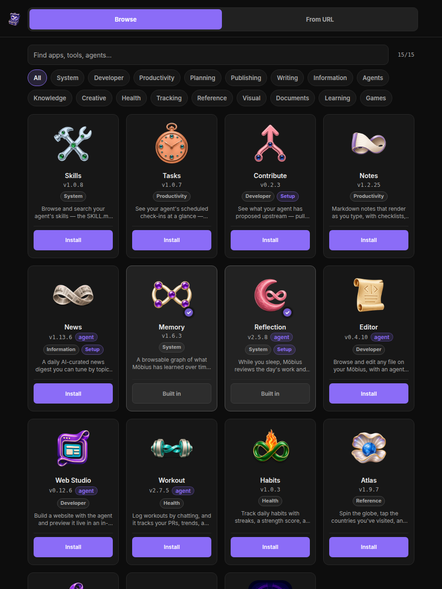

<p align="center">
  
</p>

<h1 align="center">Möbius</h1>

<p align="center">
  A personal AI agent you self-host, with one job, to be as helpful to you as possible. It answers your questions, builds the apps you need, learns what matters to you, and works overnight to be ready for tomorrow. All on a machine you own.
</p>

<p align="center">
  <a href="LICENSE"></a>
  <a href="https://hub.docker.com"></a>
  <a href="#get-started"></a>
</p>

<p align="center">
  <a href="#what-is-möbius">What is it?</a> &middot;
  <a href="#batteries-included">Batteries included</a> &middot;
  <a href="#you-grow-it">You grow it</a> &middot;
  <a href="#apps-that-work-together">Apps that work together</a> &middot;
  <a href="#it-improves-itself-for-you">It improves itself for you</a> &middot;
  <a href="#how-the-agent-itself-gets-better">How the agent gets better</a> &middot;
  <a href="#get-started">Get started</a>
</p>

<p align="center">
  <a href="#you-grow-it">An agent that adapts to you</a> &middot;
  <a href="#how-the-agent-itself-gets-better">The self-improvement harness</a> &middot;
  <a href="#apps-that-work-together">An app store that adapts to you</a>
</p>

---

## What is Möbius?

Möbius is a personal AI agent you self-host. Its one job is to be as helpful to you as it can. It answers your questions, builds the apps you reach for, picks up on what matters to you, and works in the background to anticipate what you'll need next. Most assistants get more generic the longer you use them. Möbius gets more yours.

A chat sits on one side, a full-screen canvas on the other. You describe what you want, and the coding agent inside builds it, a small piece of software that lands next to the chat, runs in your browser, and is yours to keep. The agent isn't limited to apps either. It can reshape the interface it runs inside, the theme, the layout, the features in the shell, by editing the source and rebuilding live.

It runs on Codex (free or paid ChatGPT plan) or Claude Code (any paid plan), both via OAuth, no API key needed. It installs on your phone like a native app on Android and iOS. And because it runs on _your_ server, your data stays yours.

[Get Started](#get-started) has one-click setup.

---

## Batteries included

Möbius comes with a curated app store, so you have a suite of genuinely useful personal apps from the first day, no prompt required. Tap to install, and each one is yours to use, edit, or rebuild.

<p align="center">
  
</p>

<sub>A few of the starter-pack apps. <strong>News</strong> writes you a morning digest on a schedule. <strong>Workout</strong> logs training in plain language, on-device. <strong>Atlas</strong> is a 3D globe of where you have been. <strong>Mind</strong> is a browsable graph of everything the agent has learned, every interaction and every lesson. <strong>LaTeX</strong> is an Overleaf-style editor with a real engine. <strong>Dreaming</strong> is the agent improving itself overnight.</sub>

Every app is just a public repo with a `mobius.json` and an `index.jsx`, open under [github.com/mobius-os](https://github.com/mobius-os). Installing one means pasting a URL; updating one means pasting the same URL again, which patches the code and keeps your data. There is no submission queue and nothing to be blessed by.

---

## You grow it

Möbius starts deliberately small: a chat and a canvas, and not much else. So you grow it. Ask for a feature and the agent writes it, end to end, in the same conversation. I asked for file upload in one ordinary message, _"I'd like to send files and images along with my messages,"_ and got the endpoint, the schema, the drag-and-drop overlay, the paste handler, and the thumbnails, all in one chat.

<p align="center">
  
</p>

<sub>One chat, from empty composer to working feature. Ask, answer a couple of questions, and it is in use.</sub>

The same loop builds whole apps. Some of what it has built me:

- **News aggregator** that runs on a schedule, searches the web, and filters stories around preferences that evolve over time
- **Stock dashboard** for a local exchange with no public API, which the agent figured out how to scrape
- **Finance tool** to upload statements, categorize spending, and compute taxes from your phone
- **Learning companion** that builds a curriculum around any topic with spaced repetition that adjusts as you improve
- **Period tracker**, a habit log, a drum machine that turns voice samples into beats

<p align="center">
  
</p>

<sub>Each was a single prompt. The agent wrote the JSX, compiled it, mounted it, and the app lives in the same shell the chat does. Your health data, your finances, your habits, all private by default.</sub>

You can reshape the platform the same way. "Make it warmer." "Restyle the whole shell as a 1970s synth panel." The agent edits the CSS and the new look is live in seconds.

<p align="center">
  
</p>

<sub>The same new-chat screen across a range of looks, from a medieval manuscript to a deep-blue ambient theme to fully meme-worthy. Themes and layout changes go live immediately, no rebuild.</sub>

---

## Apps that work together

Möbius apps are not sealed boxes. They share a common storage layer and a permission model, so with your say-so one app can read another's data. That turns the app store into something closer to a personal data platform. Ask for a dashboard that pulls your **Workout** log and your habit tracker into one view, and the agent can build an app that reads across both. Apps adapt and grow together, recombining the data you already own into whatever shape is useful next.

Read more in [Apps that work together](#apps-that-work-together).

---

## It improves itself for you

Möbius does not just keep your chat history. It builds a lasting memory of everything it learns, the **Mind**, a knowledge graph of every interaction and every lesson the agent picks up along the way, kept separate from any transcript so it can reason from accumulated experience instead of re-reading conversations. The Mind is browsable; it is one of the starter apps.

And every night, while you sleep, it dreams. The **Dreaming** agent reviews the day and looks for ways to be more useful to you tomorrow. It tidies and reorganizes the Mind, anticipates what you are likely to need next, suggests new apps and features worth building, and audits your instance for improvements and weak spots. You wake up to an agent that is a little sharper and a little more yours than the day before.

This nightly loop is not a gimmick. It is the self-improvement research below, productized. The same techniques we use to develop Möbius now run inside your own instance, on your behalf.

---

## How the agent itself gets better

Möbius the product improves through a self-improvement **harness** we run during development. An outer agent watches the inner one build, asks it _why_ it did what it did, and rewrites its instructions between sessions. The pairing is unusual; the moves are simple. A few findings from running that loop on ourselves:

1. Reading transcripts and patching the prompt stalls fast, because every rule you add surfaces a regression somewhere else. Asking the inner agent _why_ it acted, with the transcript still in its context, produced more durable fixes in fewer iterations than third-party theory-of-mind ever did. An agent reflecting on its _own_ experience beats a bigger agent reasoning from the outside.
2. The worry that asking the model directly just yields sycophancy turned out to be too simple. Confrontational prompts get binary compliance or defiance; warm, curious framings get the model to push back on bad premises and cooperate on good ones.
3. Once the loop works, the limit stops being the model and becomes the meta-goals you optimize for, which come from real users hitting real friction on real apps.

All of it is backed by a run of controlled experiments, not anecdotes. The coaching and ensemble methods let two agents solve more together than either does alone, and those are the lessons the Dreaming agent above now runs on your behalf.

---

## It's yours

Möbius runs in a single Docker container you control. Your chats, apps, data, theme, and the agent's memory all live on your server. The whole instance is a git repo, so a bad change can be read back and undone, and every install behaves like the [Möbius strip](https://en.wikipedia.org/wiki/M%C3%B6bius_strip) it is named after. The agent builds the surface it runs on, then uses it to build the next thing, with no clean inside or outside.

If the UI ever breaks, every instance ships with `/recover`. It resets the shell and leaves your chats, apps, and data untouched. Installs are atomic, so a failed one cannot half-land.

---

## Get started

### <a href="https://railway.com/deploy/mobius?referralCode=5TQuhr"></a>

Click **Deploy Now**, log in to Railway, and deploy. New accounts get a free month, then around $5/month for hosting. Once the deploy finishes, go to **Settings → Networking → Generate Domain**. You'll get a URL like `xxx.up.railway.app`. Open it, and the setup wizard walks you through creating your account and connecting Codex or Claude.

Bookmark `https://xxx.up.railway.app/recover`. If the UI ever breaks, that's where you fix it. On your phone, save to home screen for the best experience.

To update, go to the same deployment's **Settings → Source → Check for updates**. Railway pulls the latest image and redeploys, and chats, apps, credentials, and the agent's memory all survive.

### Deploy self-hosted

**Requirements:** a Linux server with Docker, a domain name pointing to it, and a coding provider, either Codex (free or paid plan) or Claude Code (paid plan).

```bash
git clone https://github.com/mobius-os/mobius.git
cd mobius
cp .env.example .env
sed -i 's/^DOMAIN=.*/DOMAIN=your-domain.com/' .env
docker compose up -d
```

Caddy handles HTTPS automatically. Visit `https://your-domain.com` and the setup wizard takes it from there. On a headless server, copy the auth URL to a local browser to complete sign-in.

Bookmark `https://your-domain.com/recover`. If the UI ever breaks, that's where you fix it.

To update: `git pull && docker compose up -d --build`. Everything in `/data` survives rebuilds.

---

## License

[MIT](LICENSE)
