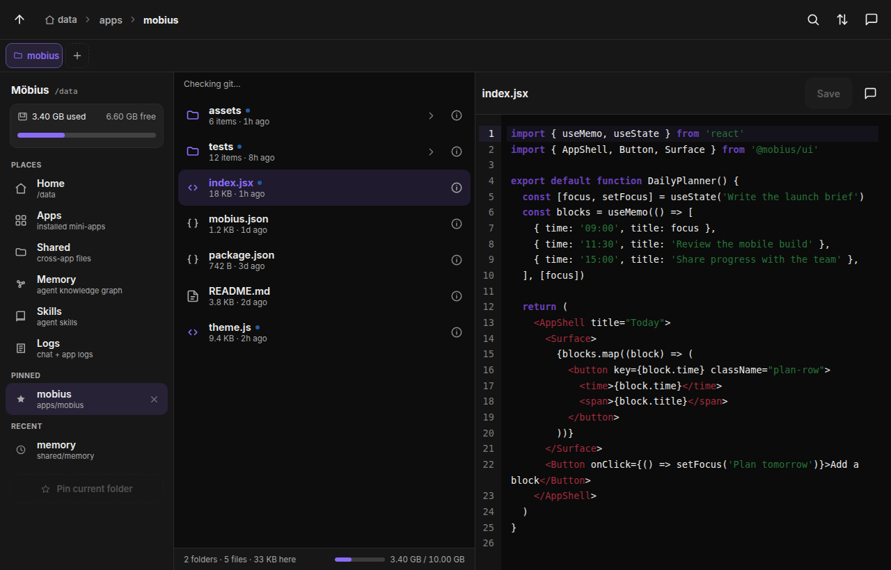
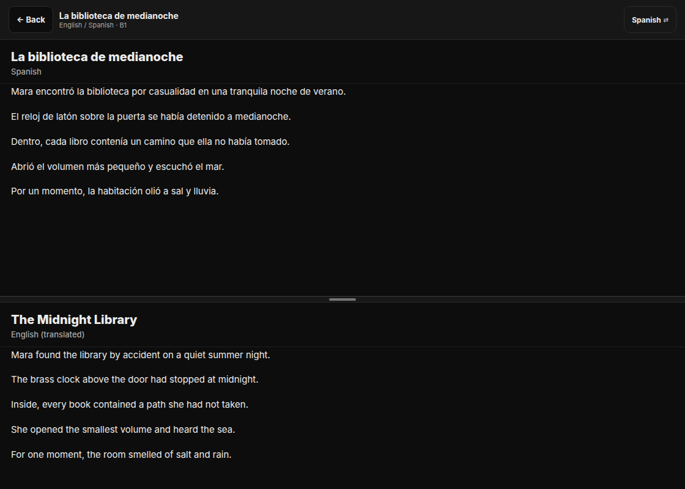
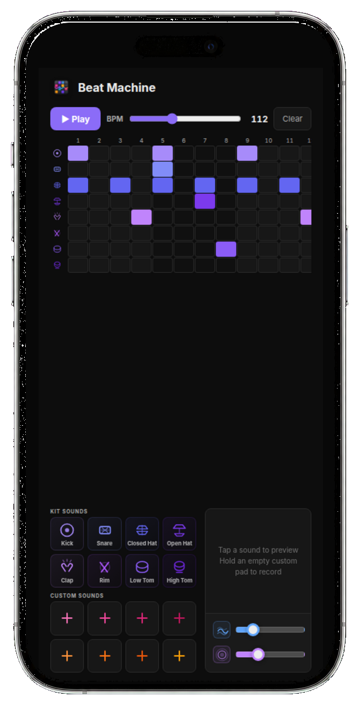
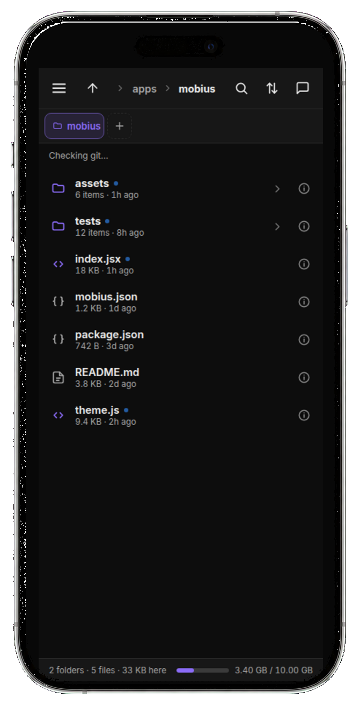

<p align="center">
  
</p>

<h1 align="center">Möbius</h1>

<p align="center">
  A community-built AGI app platform. Build the apps you need, shape the workspace around your life, and improve the system through use.
</p>

<p align="center">
  <a href="LICENSE"></a>
  <a href="https://hub.docker.com"></a>
  <a href="#launch-your-möbius"></a>
</p>

<p align="center">
  <a href="https://mobius.you/"><strong>Launch Möbius</strong></a> ·
  <a href="https://mobius-os.github.io/apps/">Browse apps</a> ·
  <a href="#build-a-möbius-app">Build an app</a> ·
  <a href="#contribute-to-the-platform">Contribute</a>
</p>



## Build apps around the way you work

Möbius is a self-hosted workspace where a coding agent builds apps beside the conversation. Describe what you need, inspect the result, and keep the app in the same place where you use it.

Apps are ordinary repositories with readable source and a small manifest. Start with a community app, change it for your workflow, or build the missing piece with your agent.

<table>
  <tr>
    <td width="52%"></td>
    <td width="48%"></td>
  </tr>
  <tr>
    <td><strong>Tandem:</strong> read generated stories in two languages at your chosen level.</td>
    <td><strong>Beat Machine:</strong> sketch a beat, shape the sound, and add your own recordings.</td>
  </tr>
</table>

## Use the same workspace on phone and web

Möbius runs as a progressive web app (PWA). Your apps, files, chat, memory, and settings stay together across a computer and phone.

<table>
  <tr>
    <td width="67%"></td>
    <td width="33%"></td>
  </tr>
</table>

## Personalize the whole platform

The workspace can change with you. Themes reshape the shell, Memory keeps durable context available, and Reflection reviews completed work for improvements worth carrying forward.

<table>
  <tr>
    <td width="36%"></td>
    <td width="64%"></td>
  </tr>
  <tr>
    <td><strong>Memory:</strong> connect facts, decisions, preferences, and projects.</td>
    <td><strong>Themes:</strong> change the full workspace, not one isolated app.</td>
  </tr>
</table>

## Build toward AGI in public

Möbius is a community-built artificial general intelligence (AGI) project grounded in useful apps. It does not claim that general intelligence has already been solved. The project asks what becomes possible when a capable agent can build tools, modify its platform, remember useful context, and learn from real friction.

Möbius deliberately supports coding agents that can work across a real repository. Today, that means OpenAI Codex and Claude Code. The owner chat agent can edit the frontend and backend, while git history and `/recover` keep those changes reversible.

The improvement loop stays concrete:

1. Build an app for a real need
2. Notice repeated friction through use, Memory, and Reflection
3. Turn a useful pattern into a skill, app change, or platform capability
4. Review and share the parts that should help the wider community

No autonomous rewrite ships without a person in the loop. Agents can prepare changes, run tests, and explain their reasoning. People still decide what becomes part of the shared platform.

## Start with the community catalog

The App Store includes tools for notes, tasks, skills, memory, reflection, development, news, health, and learning. Each app is a public repository under the [Möbius OS GitHub organization](https://github.com/mobius-os).


Installing an app means adding its repository URL. Updating the same URL patches the code while keeping the app's data.

## Bring agent access

Möbius uses an agent account you already control. Connect one of these providers during setup:

- **OpenAI Codex**: sign in with a ChatGPT plan that includes Codex access. Usage limits depend on the plan. See [Using Codex with your ChatGPT plan](https://help.openai.com/en/articles/11369540-using-codex-with-your-chatgpt-plan)
- **Claude Code**: sign in with a supported Claude Code plan

Möbius uses provider sign-in, so the default setup does not require a separate API key.

## Launch your Möbius

[Möbius Launch](https://mobius.you/) creates a private deployment in a Railway account you control:

1. Sign in to Möbius Launch
2. Connect your Railway workspace
3. Review the deployment and open your Möbius instance

Your chats, files, apps, credentials, and agent activity stay inside that deployment. Möbius Launch stores only the account and infrastructure data needed to create and manage it.

### Deploy on your own server

Use a Linux server with Docker, a domain name, and Codex or Claude Code access:

```bash
git clone https://github.com/mobius-os/mobius.git
cd mobius
cp .env.example .env
sed -i 's/^DOMAIN=.*/DOMAIN=mobius.example.com/' .env
docker compose up -d
```

Caddy configures HTTPS. Open `https://mobius.example.com` and follow the setup wizard. Bookmark `/recover` before asking the agent to change the platform.

Update a self-hosted instance with:

```bash
git pull
docker compose up -d --build
```

Data under `/data` survives rebuilds.

## Build a Möbius app

A Möbius app needs a `mobius.json` manifest and an `index.jsx` component. The component receives `{ appId, token }` and stores data through the app storage API.

Start with these references:

- [Building apps](backend/scripts/seed-skills/building-apps.md): app structure, storage, permissions, themes, and publishing
- [App component shapes](backend/scripts/seed-skills/app-component-shapes.md): supported React component contracts
- [Architecture](ARCHITECTURE.md): platform boundaries and the complete manifest reference
- [Community app catalog](https://github.com/mobius-os): working apps to inspect and fork

## Contribute to the platform

Möbius grows through apps, platform changes, testing, and discussion. A local improvement can stay private or become a reviewed contribution through the Contribute app and GitHub.

Read [CONTRIBUTING.md](CONTRIBUTING.md) for the development loop and [ARCHITECTURE.md](ARCHITECTURE.md) for the system map.

## License

[MIT](LICENSE)
