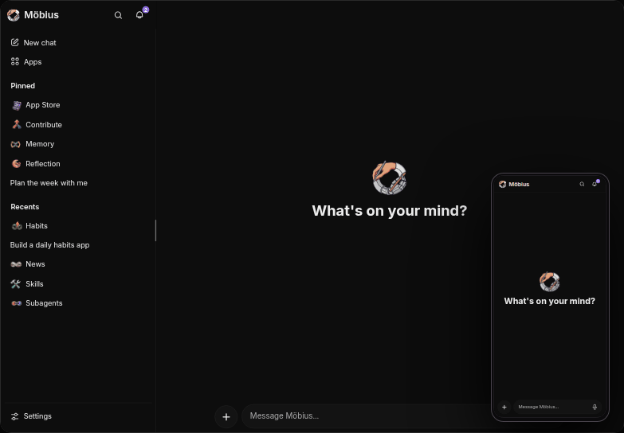
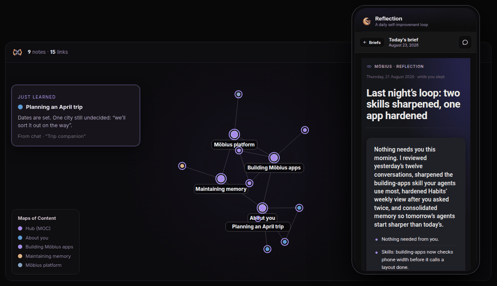
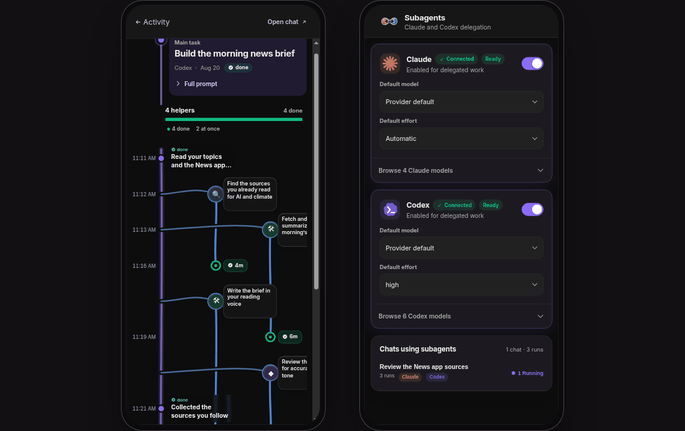
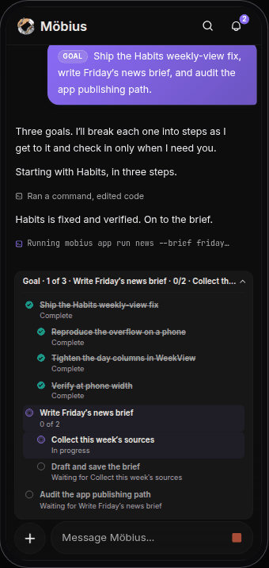
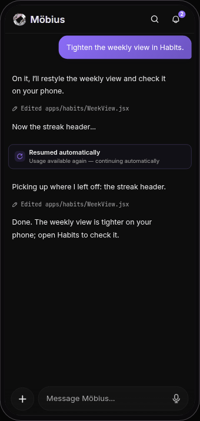
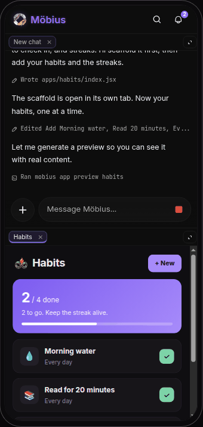
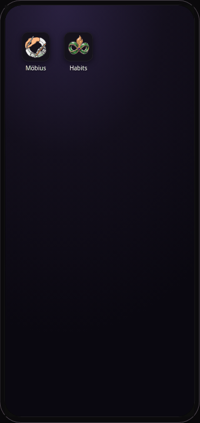
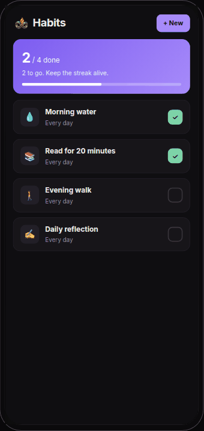
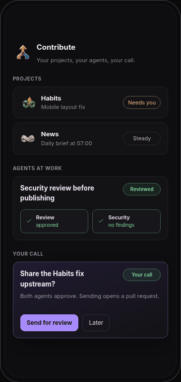

<p align="center">
  
</p>

<h1 align="center">Möbius</h1>

<p align="center">
  Your portal to the world of AI agents. One home for your agent, on web, on your phone, on a server you control. Make it yours, put it to work, and build with other agents and other people.
</p>

<p align="center">
  <a href="LICENSE"></a>
  <a href="https://hub.docker.com"></a>
  <a href="#yours-to-run-yours-to-change"></a>
</p>

<p align="center">
  <a href="https://mobius.you/"><strong>Start for free</strong></a> ·
  <a href="https://mobius.you/#build">See it working</a> ·
  <a href="https://github.com/orgs/mobius-os/repositories?q=app-">Browse apps</a> ·
  <a href="#contribute-to-the-platform">Contribute</a>
</p>



## One agent. Here is what it does for you.

Möbius is the harness and the interface for working with AI agents: a self-hosted workspace where apps, agents, memory, skills, files, and source live together, on your computer and on your phone. Everything here is shown live at [mobius.you](https://mobius.you/), with the real shell and real apps.

| | |
|---|---|
| **Your agent, everywhere** | On the web, on your phone, on a server you control. |
| **It learns how you work** | Memory, a nightly Reflection, and Skills you browse and install. |
| **Work that runs on its own** | Goals, scheduled Tasks, workflows of helpers, follow-ups that wait their turn. |
| **Apps on the fly** | Describe an app. It is built beside the chat and lands on your phone. |
| **Connected to your tools** | Connections: Notion, Linear, Google Cloud, GitLab, Stripe, Supabase, and any remote MCP service. |
| **Community, and fun** | An App Store, contributing with humans and agents, games to play. |

## Your agent starts as an intern and matures through your feedback

The agent you get on day one is a generalist. The one you have a month later knows your projects, your preferences, and the way you like things done, because everything it learns stays with it.

- **Memory.** Every conversation leaves something behind: a decision, a preference, how a project is wired. Your agent keeps it, links it, and cites it the next time it matters.
- **Feedback that sticks.** Correct it once and the correction outlives the chat. Skills, memory, and the apps it built all move with what you told it.
- **Reflection.** Every night it goes over the day, sharpens the skills, apps, and memory your agents work from, and leaves you a morning brief. Each change is small and reversible; together they compound.
- **Skills.** The playbooks behind the work, browsable and installable, sharpened by Reflection and by you.



## Put it to work

- **Goals.** Type `/goal` and a to-do list becomes a goal the agent keeps pursuing across turns, breaking each item into steps and checking in only when it needs you.
- **Tasks.** Scheduled jobs: a morning brief, a daily check, a weekly report, each a run you can read afterwards.
- **Workflows and Subagents.** Every run on a readable timeline: which helpers your agent created, when, and what each came back with. Delegation to Claude and Codex stays visible.
- **Queue.** Send a follow-up while the agent works. It waits in line, ready to edit or drop, and runs the moment the turn ends.

A usage limit parks the run and picks it back up on its own. An API key goes in through a secure input the model never sees. A voice model on your device answers out loud, and nothing leaves your Möbius. It works the same with Claude Code and with ChatGPT (Codex).



<table>
  <tr>
    <td width="50%"></td>
    <td width="50%"></td>
  </tr>
  <tr>
    <td><strong>Goals:</strong> three things to get done, each broken into steps as the agent reaches it.</td>
    <td><strong>Limits:</strong> a usage limit parks the run; it resumes on its own and finishes the job.</td>
  </tr>
</table>

## Build apps on the fly

Say what you need in your own words: “Build a News app for the topics I follow.” “Build a simple habits app.” The agent builds it beside the conversation, opens the working result in its own pane, and keeps refining it from your feedback. On your phone the same flow ends with the app on your home screen, opening as its own app.

<table>
  <tr>
    <td width="33%"></td>
    <td width="33%"></td>
    <td width="33%"></td>
  </tr>
  <tr>
    <td><strong>Build:</strong> the pane rises below the chat while the agent works.</td>
    <td><strong>Install:</strong> hold the app in the drawer and add it to the home screen.</td>
    <td><strong>Open:</strong> the finished app owns the screen.</td>
  </tr>
</table>

Apps can be anything: a daily news brief, a drum machine, a 3D runner, a bilingual reader with its own agent inside. Install what others built from the App Store, then publish your own. Every app is a public repository under the [Möbius OS organization](https://github.com/mobius-os).


## Collaborate with humans and agents alike

Contribute keeps your projects, your agents, and your decisions in one place: spin up agents on a project, review what each of them did, and have only the decisions that matter brought to you. What generalizes can go back to the community as a reviewed contribution. No autonomous rewrite ships without a person in the loop.

<p align="center"></p>

## Yours to run. Yours to change.

Möbius is open source, MIT licensed. The agent, your apps, your memory, and the platform itself run on a server you control. Bring the provider plan you already pay for; no separate API key is needed.

**Hosted for you.** [mobius.you](https://mobius.you/) creates a private deployment in a Railway account you control: sign in with Google or Apple, connect Railway, open your Möbius. Up to $5 in hosting credit for 30 days, usually no card. Your chats, files, apps, credentials, and agent activity stay inside that deployment.

**On your own server.** You need Docker, a domain name, and a Claude Code or ChatGPT (Codex) account:

```bash
git clone https://github.com/mobius-os/mobius.git
cd mobius
cp .env.example .env
sed -i 's/^DOMAIN=.*/DOMAIN=mobius.example.com/' .env
BUILD_SHA="$(git rev-parse HEAD)" \
BUILD_DATE="$(git show -s --format=%cs HEAD)" \
docker compose up -d --build
```

Caddy configures HTTPS. Open `https://mobius.example.com`, connect your provider, and start asking. Settings → Möbius applies platform updates; `docker compose exec -u 0 app bash` opens a root shell in the running container. See [.env.example](.env.example) and [ARCHITECTURE.md](ARCHITECTURE.md) for the trust boundaries.

## Contribute to the platform

Möbius grows through apps, platform changes, testing, and discussion. A local improvement can stay private or become a reviewed contribution through the Contribute app and GitHub. To work on the platform itself, read [CONTRIBUTING.md](CONTRIBUTING.md) and [ARCHITECTURE.md](ARCHITECTURE.md).

## License

[MIT](LICENSE)
