<p align="center">
  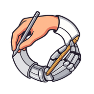
</p>

<h1 align="center">Möbius</h1>

<p align="center">
  The front page for agentic work. Build apps, run agents, and keep the memory that makes the next run better.
</p>

<p align="center">
  <a href="LICENSE"></a>
  <a href="https://hub.docker.com"></a>
  <a href="#launch-your-möbius"></a>
</p>

<p align="center">
  <a href="https://mobius.you/"><strong>Launch Möbius</strong></a> ·
  <a href="#start-with-the-app-store">Browse apps</a> ·
  <a href="#build-apps-and-run-agents">Build with agents</a> ·
  <a href="#contribute-to-the-platform">Contribute</a>
</p>

## The front page for agentic work

Möbius is a self-hosted workspace where apps, agents, memory, skills, files, and source live together. Run several agents side by side, start with what exists, build what is missing, and keep the result where you use it.

Agents can work with you in chat, inside apps, or through scheduled background work. Memory grows with useful context from the work. Reflection reviews repeated friction and prepares improvements that you can inspect and choose to keep.

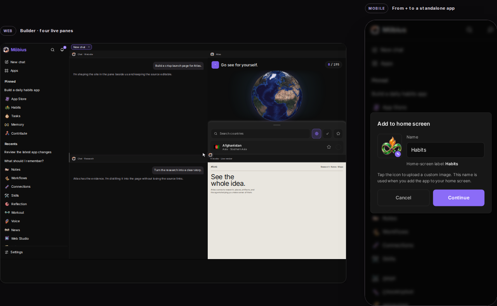

The [app-building story](https://mobius.you/#build) renders the current shell as web elements instead of playing a screenshot. It opens four Builder panes on the web. On mobile, it presses the real + menu, adds Habits beside Möbius, selects the exact icon, and opens the production app standalone.

## Start with the App Store

The App Store includes everyday tools and the parts that help Möbius run itself. Browse apps for writing, planning, learning, health, creation, memory, connected tools, background work, and development. Its collections, summaries, state, and artwork come from the published apps. The [App Store showcase](https://mobius.you/#apps) renders the current catalog inside the production Möbius shell.

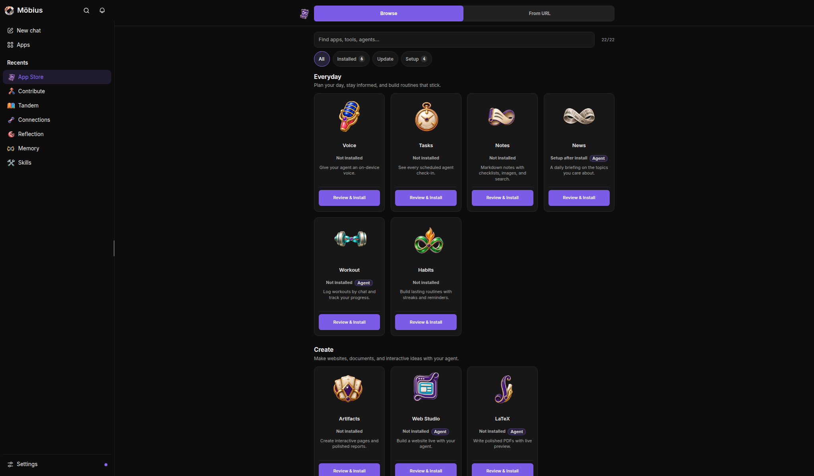

<table>
  <tr>
    <td align="center" width="25%"><br><strong>Voice</strong></td>
    <td align="center" width="25%"><br><strong>Tasks</strong></td>
    <td align="center" width="25%">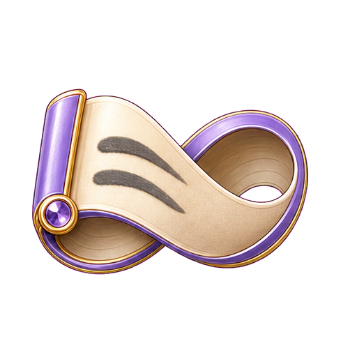<br><strong>Notes</strong></td>
    <td align="center" width="25%"><br><strong>News</strong></td>
  </tr>
  <tr>
    <td align="center"><br><strong>Workout</strong></td>
    <td align="center"><br><strong>Habits</strong></td>
    <td align="center"><br><strong>Artifacts</strong></td>
    <td align="center">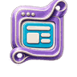<br><strong>Web Studio</strong></td>
  </tr>
  <tr>
    <td align="center"><br><strong>LaTeX</strong></td>
    <td align="center">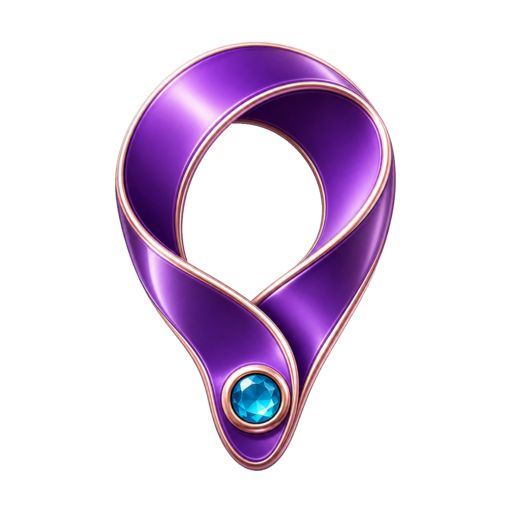<br><strong>Maps</strong></td>
    <td align="center"><br><strong>Atlas</strong></td>
    <td align="center"><br><strong>Tandem</strong></td>
  </tr>
  <tr>
    <td align="center"><br><strong>Beat Machine</strong></td>
    <td align="center"><br><strong>CubeRun</strong></td>
    <td align="center"><br><strong>Memory</strong></td>
    <td align="center"><br><strong>Connections</strong></td>
  </tr>
  <tr>
    <td align="center"><br><strong>Reflection</strong></td>
    <td align="center">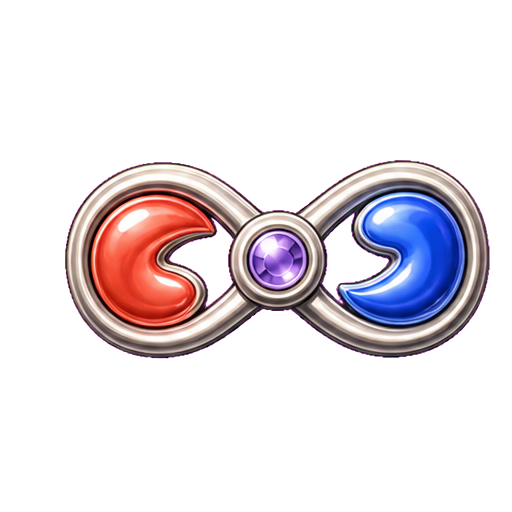<br><strong>Subagents</strong></td>
    <td align="center">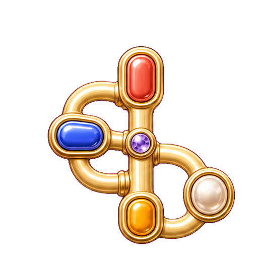<br><strong>Workflows</strong></td>
    <td align="center">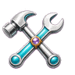<br><strong>Skills</strong></td>
  </tr>
  <tr>
    <td align="center"><br><strong>App Store</strong></td>
    <td align="center">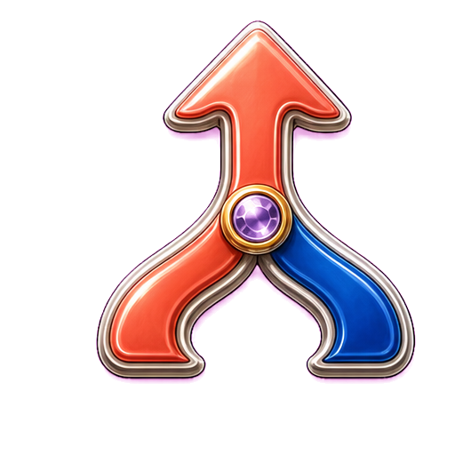<br><strong>Contribute</strong></td>
    <td align="center">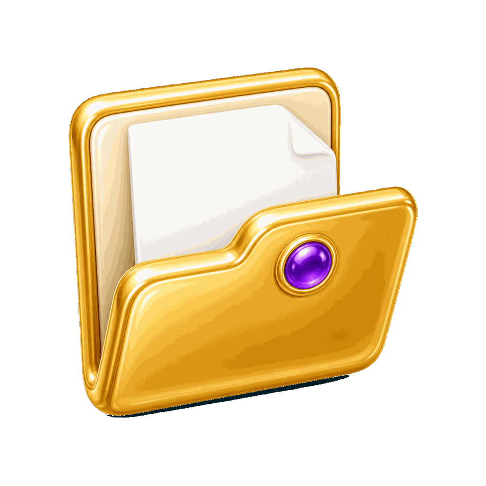<br><strong>Editor</strong></td>
    <td></td>
  </tr>
</table>

Each community app is a public repository under the [Möbius OS GitHub organization](https://github.com/mobius-os). Install a reviewed app from the catalog or bring a public manifest URL, then ask your agent to make it yours. Updates preserve the app's data and local changes.

## Build apps around the way you work

You do not need to know how Möbius apps are built. Tell your agent what would make your work easier, inspect the working result beside the conversation, and keep refining it from your feedback.

<table>
  <tr>
    <td width="34%">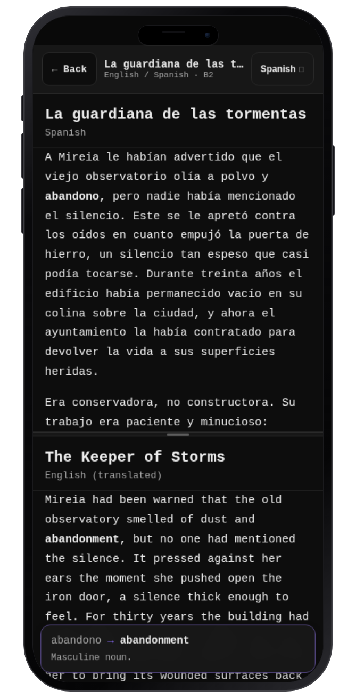</td>
    <td width="66%">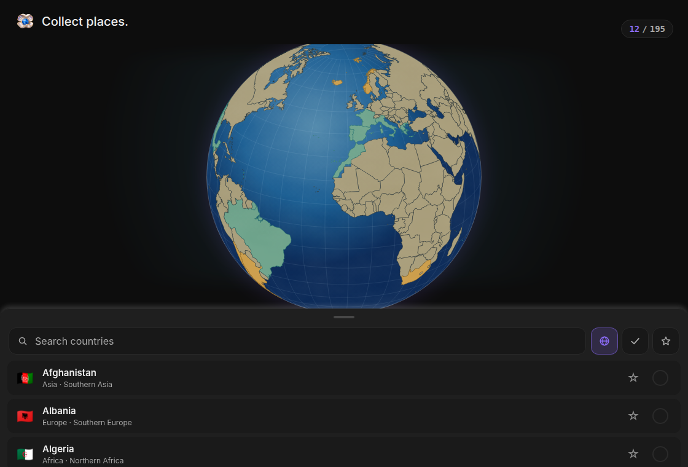</td>
  </tr>
  <tr>
    <td><strong>Tandem:</strong> read generated stories in two languages at your chosen level.</td>
    <td><strong>Atlas:</strong> collect the places you have visited and save where you want to go next.</td>
  </tr>
</table>

Other apps can be as personal as the trip they support. Brazil 2026 keeps an itinerary, local phrases, weather, packing, and a journal together. News prepares a daily digest around the topics you care about.

CubeRun shows that an app does not have to be another work utility. An agent can build a game, render its world live, and leave it beside the chats and tools that created it.

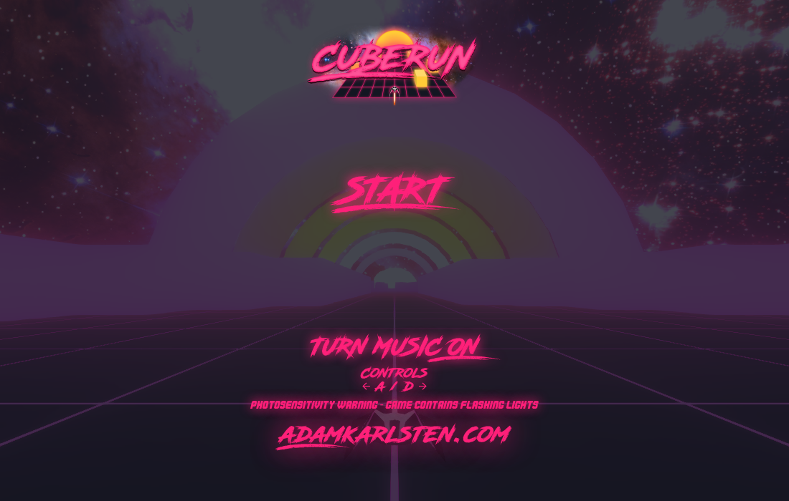

## Build apps and run agents

Open a chat and describe the outcome you want in your own words. For example:

- “Build me a meal planner that remembers our favourite recipes.”
- “Add a weekly view and quicker task entry to my planner.”
- “Run this check every morning and tell me when something changes.”

Your agent can build or adapt the app, work with real files, use connected tools, and set up recurring work. Workflows, Skills, Tasks, and Subagents keep the instructions and delegated work visible. Maps, Artifacts, documents, and websites keep the outputs close to their source context.

Apps can take different forms. Beat Machine runs as a focused mobile instrument. Voice downloads its model, keeps the text editable, and can run a voice agent from the same surface.

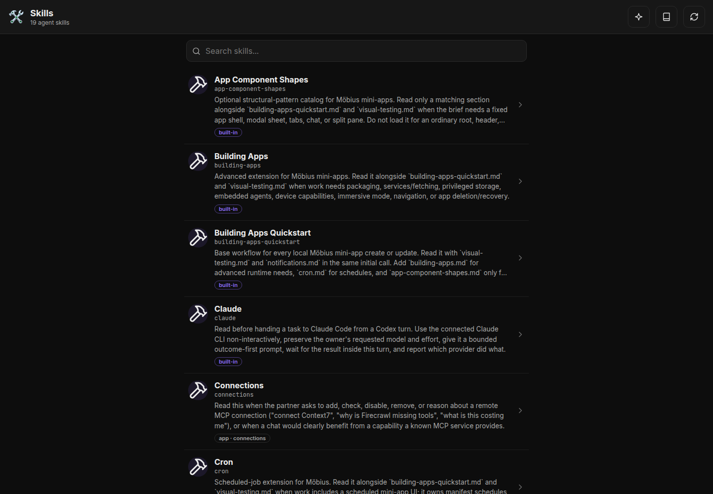

No autonomous rewrite ships without a person in the loop. Agents can prepare changes, run tests, and explain their reasoning. People still decide what becomes part of their Möbius or the shared platform.

## Use the same workspace on phone and web

Möbius runs as a progressive web app (PWA). On the web, hold the top-left Möbius mark or press Shift + Enter to open panes beside the conversation. On mobile, press + to attach files or choose a model, then describe the app you want in the composer. The agent says it will build a draft, opens a tab, and adds the surface, identity, and content in order. Different devices can build different apps; they do not have to be mirrored views of the same example.

<table>
  <tr>
    <td width="72%">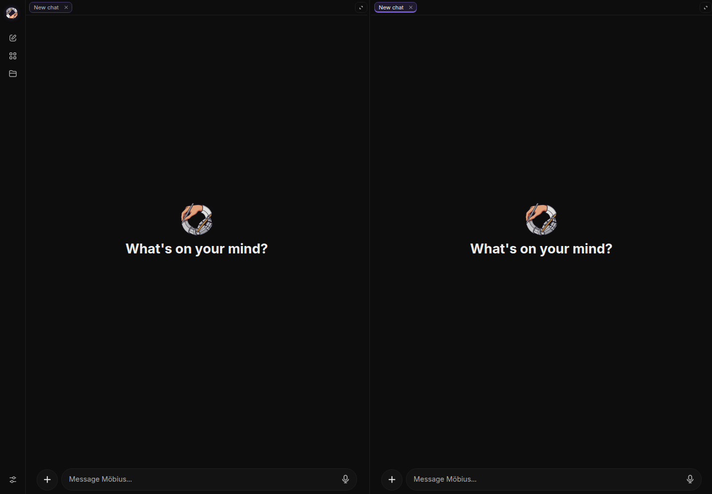</td>
    <td width="28%">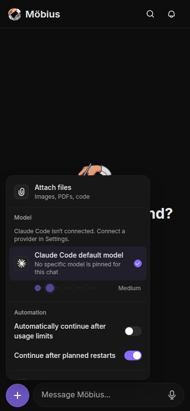</td>
  </tr>
  <tr>
    <td><strong>Web:</strong> keep the App Store, Contribute, chats, and other working panes visible together.</td>
    <td><strong>Mobile:</strong> press + for files, model, and effort selection.</td>
  </tr>
</table>

An installed app can also become its own home-screen entry. The [mobile sequence](https://mobius.you/#build) shows Habits appearing beside Möbius, a cursor selecting the exact icon, and the production-compiled app running without Möbius chrome.

<table>
  <tr>
    <td width="33%">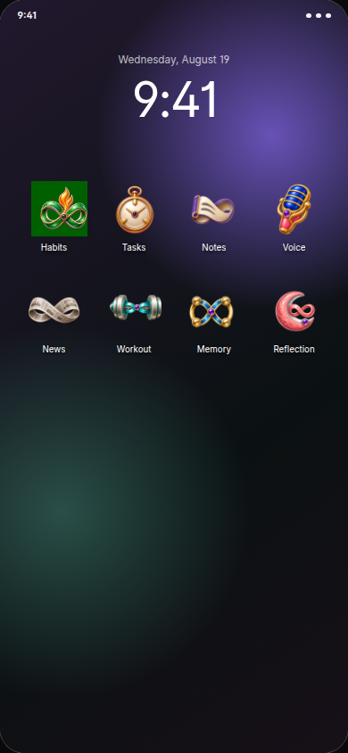</td>
    <td width="33%">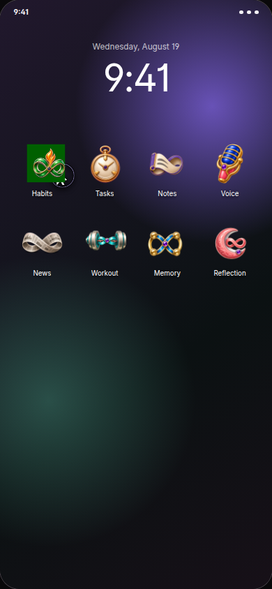</td>
    <td width="33%">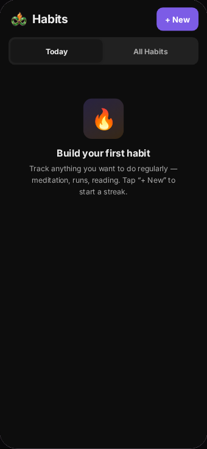</td>
  </tr>
  <tr>
    <td><strong>Install:</strong> the created app joins the home screen.</td>
    <td><strong>Open:</strong> the same icon launches the app.</td>
    <td><strong>Standalone:</strong> the finished app owns the screen.</td>
  </tr>
</table>

## Memory and self-improvement are built in

Memory connects facts, decisions, preferences, and projects so useful context can survive the conversation where it first appeared. Reflection runs on a schedule, reviews completed work, and turns recurring friction into a better setting, skill, app change, or proposal.

<table>
  <tr>
    <td width="34%">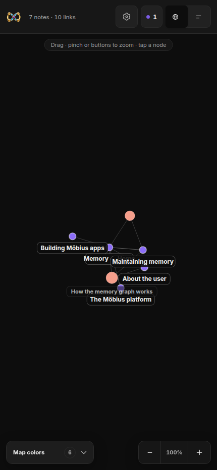</td>
    <td width="66%">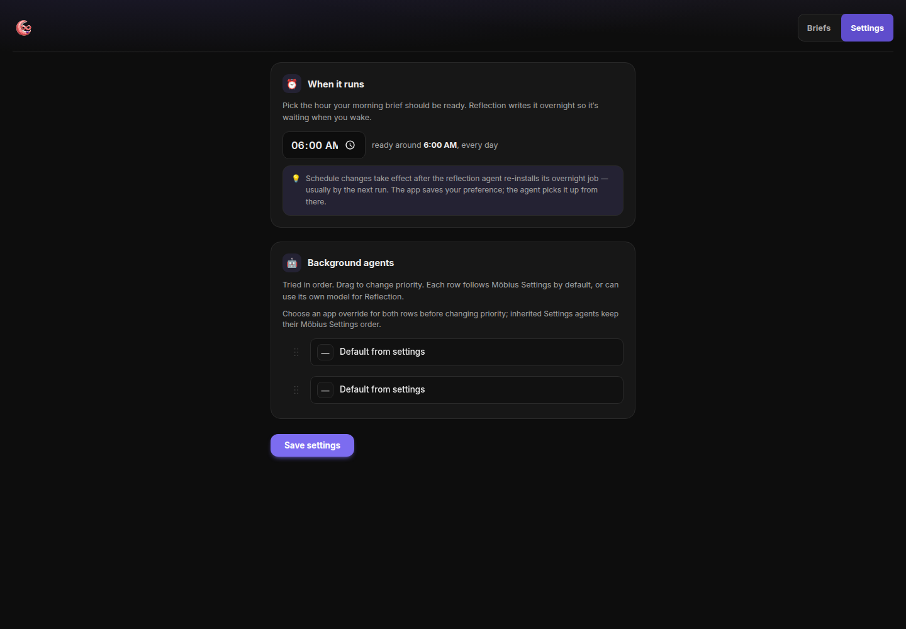</td>
  </tr>
  <tr>
    <td><strong>Memory:</strong> durable context shared across apps and agents.</td>
    <td><strong>Reflection:</strong> scheduled review with explicit background-agent settings.</td>
  </tr>
</table>

Themes can reshape the full workspace. The website example asks for a dynamic Halloween theme, then shows Reflection report faster repeated work, improved skills, fixed bugs, and cleared stale memories. The Memory graph grows as the agent inspects what it knows about the user. Git history keeps the source change inspectable and recoverable.

## Improve an open-source system

Möbius grows with the needs of the people using it. Anyone can build an app or platform change for their own work. When an idea helps beyond one person, Contribute gives it a path back to the community. Shared apps and platform improvements can raise the starting point for everyone.

Contribute keeps that path inspectable. A private review agent can refresh a proposal before it is sent. A security audit can trace permission-bearing paths. GitHub checks and labels stay visible, and nothing is published automatically. Watch the [review and security-check sequence](https://mobius.you/#agents) run across open work.

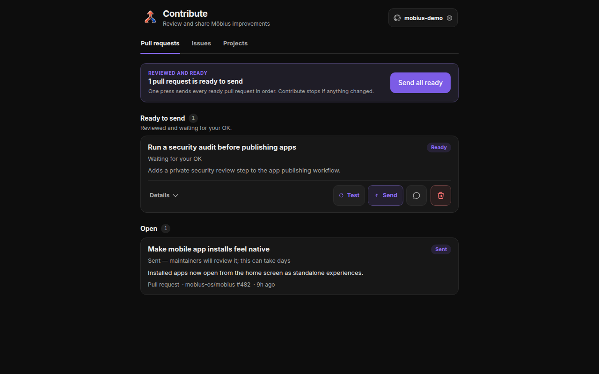

<table>
  <tr>
    <td width="96" align="center">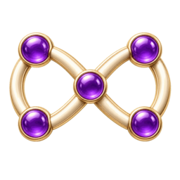</td>
    <td><strong>Memory</strong><br>Personalize the platform with context worth keeping.</td>
  </tr>
  <tr>
    <td width="96" align="center"></td>
    <td><strong>Reflection</strong><br>Turn repeated friction into the next improvement.</td>
  </tr>
  <tr>
    <td width="96" align="center">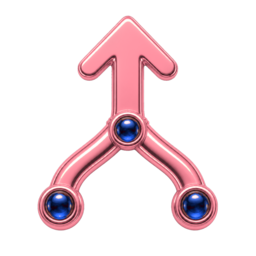</td>
    <td><strong>Contribute</strong><br>Share apps and platform changes that can help others.</td>
  </tr>
</table>

Build for a real need, make it yours, improve what gets in the way, then share what generalizes. Community review can turn that work into a building block that makes the whole ecosystem more capable.

Möbius deliberately supports coding agents that can work across a real repository. Today, that means OpenAI Codex and Claude Code. The owner chat agent can edit the frontend and backend, while git history keeps those changes reversible.

## Bring agent access

Möbius uses an agent account you already control. Connect one of these providers during setup:

- **OpenAI Codex**: sign in with a ChatGPT plan that includes Codex access. Usage limits depend on the plan.
- **Claude Code**: sign in with a supported Claude Code plan

Möbius uses provider sign-in, so setup does not require a separate application programming interface (API) key. Reflection is its adaptive overnight loop: it learns from recent work, anticipates likely needs, and improves recurring workflows.

## Launch your Möbius

[Möbius Launch](https://mobius.you/) creates a private deployment in a Railway account you control:

1. Sign in to Möbius Launch
2. Connect your Railway workspace
3. Review the deployment and open your Möbius instance

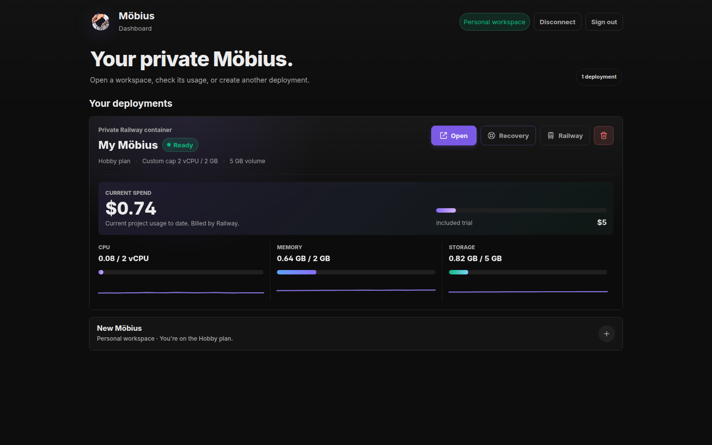

During normal use, your chats, files, apps, credentials, and agent activity stay inside that deployment. Möbius Launch stores the account and infrastructure data needed to manage it.

If the Möbius interface is unavailable, open its deployment card in Möbius Launch and choose **Open Recovery**. The launcher creates a separate temporary worker, where you connect Codex or Claude and work on the exact live container through Railway's native Secure Shell (SSH) endpoint. Recovery does not restart or redeploy Möbius, and the worker is removed when you finish or the session expires.

### Deploy on your own server

Use a Linux server with Docker, a domain name, and Codex or Claude Code access:

```bash
git clone https://github.com/mobius-os/mobius.git
cd mobius
cp .env.example .env
sed -i 's/^DOMAIN=.*/DOMAIN=mobius.example.com/' .env
BUILD_SHA="$(git rev-parse HEAD)" \
BUILD_DATE="$(git show -s --format=%cs HEAD)" \
docker compose up -d --build
```

Caddy configures HTTPS. Open `https://mobius.example.com` and follow setup. Use
Settings → Möbius to review and apply updates. For host-level maintenance, open
a root shell in the running container without recreating it:

```bash
docker compose exec -u 0 app bash
```

The in-product agent has passwordless full root inside its Möbius container by
default. To use the operator kill switch, set `MOBIUS_AGENT_SUDO=0` in `.env`
and recreate the app with `docker compose up -d --force-recreate app`.

To connect a full web service such as Tandoor, point a sibling DNS name at the same server. For example, use `services.mobius.example.com`, then set it as `MOBIUS_SERVICE_GATEWAY_ORIGIN` in `.env`. Caddy serves integrations below `/services/<slug>`, so you do not need wildcard DNS or a new record for each service. See [.env.example](.env.example) for setup and [ARCHITECTURE.md](ARCHITECTURE.md#app-execution-tiers) for the trust boundaries.

## Contribute to the platform

Möbius grows through apps, platform changes, testing, and discussion. A local improvement can stay private or become a reviewed contribution through the Contribute app and GitHub.

If you want to work on the platform itself, read [CONTRIBUTING.md](CONTRIBUTING.md) for the development loop and [ARCHITECTURE.md](ARCHITECTURE.md) for the system map.

## License

[MIT](LICENSE)
