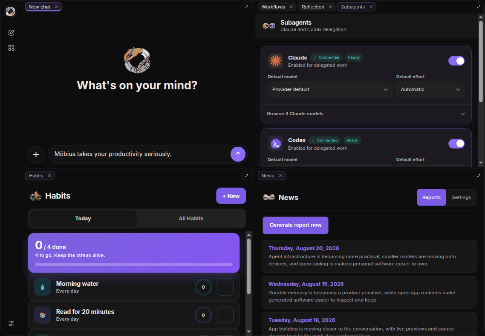
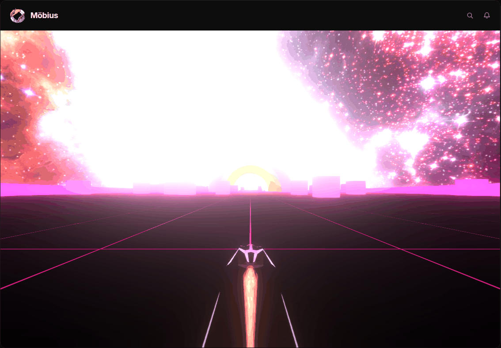

<p align="center">
  
</p>

<h1 align="center">Möbius</h1>

<p align="center">
  Your portal to the world of AI agents. One home for your agent, on web, on your phone, on a server you control. Make it yours, put it to work, and build with other agents and other people.
</p>

<p align="center">
  <a href="LICENSE"></a>
  <a href="https://hub.docker.com"></a>
  <a href="#yours-to-run-yours-to-change"></a>
</p>

<p align="center">
  <a href="https://mobius.you/"><strong>Start for free</strong></a> ·
  <a href="https://mobius.you/#build">See it working</a> ·
  <a href="https://github.com/orgs/mobius-os/repositories?q=app-">Browse apps</a> ·
  <a href="#contribute-to-the-platform">Contribute</a>
</p>

## One agent. Here is what it does for you.

Möbius is the harness and the interface for working with AI agents: a self-hosted workspace where apps, agents, memory, skills, files, and source live together. It runs as a progressive web app, so the same workspace is on your computer and on your phone. Everything below is shown live at [mobius.you](https://mobius.you/), with the real shell and real apps.

| | |
|---|---|
| **Your agent, everywhere** | On the web, on your phone, on a server you control. |
| **Apps on the fly** | Describe an app. It is built beside the chat and lands on your phone. |
| **It learns how you work** | Memory, a nightly Reflection, and Skills you browse and install. |
| **Work that runs on its own** | Goals, scheduled Tasks, workflows of helpers, follow-ups that wait their turn. |
| **Connected to your tools** | Connections: Notion, Linear, Google Cloud, GitLab, Stripe, Supabase, and any remote MCP service. |
| **Community, and fun** | An App Store, contributing with humans and agents, games to play. |



## Build apps on the fly

Open a chat and say what you need in your own words:

- “Build a News app for the topics I follow.”
- “Build a simple habits app.”
- “Make the whole workspace calmer and easier to read on my phone.”

The agent builds it beside the conversation, opens the working result in its own pane, and keeps refining it from your feedback. Hold the Möbius mark and Builder mode deals the workspace into panes: the chat, the apps you are shaping, and the agents' runs, all in view at once.

On your phone the same flow ends with the app on your home screen, opening as its own app.

<table>
  <tr>
    <td width="33%"></td>
    <td width="33%"></td>
    <td width="33%"></td>
  </tr>
  <tr>
    <td><strong>Build:</strong> the pane rises below the chat while the agent works.</td>
    <td><strong>Install:</strong> hold the app in the drawer and add it to the home screen.</td>
    <td><strong>Open:</strong> the finished app owns the screen.</td>
  </tr>
</table>

## Apps can be anything

A daily news brief, a drum machine, a 3D runner, a bilingual reader, a living globe. Install what others built from the App Store, then publish your own. Every app is a public repository under the [Möbius OS organization](https://github.com/mobius-os), and the catalog grows with the community.


<table>
  <tr>
    <td align="center" width="20%"><br><strong>Habits</strong></td>
    <td align="center" width="20%"><br><strong>News</strong></td>
    <td align="center" width="20%"><br><strong>Notes</strong></td>
    <td align="center" width="20%"><br><strong>Tasks</strong></td>
    <td align="center" width="20%"><br><strong>Voice</strong></td>
  </tr>
  <tr>
    <td align="center"><br><strong>Workout</strong></td>
    <td align="center"><br><strong>Artifacts</strong></td>
    <td align="center"><br><strong>Web Studio</strong></td>
    <td align="center"><br><strong>LaTeX</strong></td>
    <td align="center"><br><strong>Maps</strong></td>
  </tr>
  <tr>
    <td align="center"><br><strong>Atlas</strong></td>
    <td align="center"><br><strong>Tandem</strong></td>
    <td align="center"><br><strong>Beat Machine</strong></td>
    <td align="center"><br><strong>CubeRun</strong></td>
    <td align="center"><br><strong>Editor</strong></td>
  </tr>
  <tr>
    <td align="center"><br><strong>Memory</strong></td>
    <td align="center"><br><strong>Reflection</strong></td>
    <td align="center"><br><strong>Skills</strong></td>
    <td align="center"><br><strong>Connections</strong></td>
    <td align="center"><br><strong>Subagents</strong></td>
  </tr>
  <tr>
    <td align="center"><br><strong>Workflows</strong></td>
    <td align="center"><br><strong>App Store</strong></td>
    <td align="center"><br><strong>Contribute</strong></td>
    <td></td>
    <td></td>
  </tr>
</table>

<table>
  <tr>
    <td width="34%"></td>
    <td width="66%"></td>
  </tr>
  <tr>
    <td><strong>Tandem:</strong> an agent inside the app writes a story in two languages at your level.</td>
    <td><strong>CubeRun:</strong> an app does not have to be a work tool. An agent can build a game and leave it beside the chats that made it.</td>
  </tr>
</table>

## Your agent starts as an intern and matures through your feedback

- **Memory.** Every conversation leaves something behind: a decision, a preference, how a project is wired. Your agent keeps it, links it, and cites it the next time it matters.
- **Feedback that sticks.** Correct the agent once and the correction outlives the chat. Skills, memory, and the apps it built all move with what you told it.
- **Reflection.** While you sleep, Reflection goes over the day and improves the skills, apps, and memory your agents work from. You wake up to a short brief of what changed. Every change is small and reversible; together they compound.
- **Skills.** The playbooks behind the work, browsable and installable, sharpened by Reflection and by you.


## Work that runs on its own

- **Goals.** Type `/goal` and a to-do list becomes a goal the agent keeps pursuing across turns, breaking each item into steps and checking in only when it needs you.
- **Tasks.** Scheduled jobs: a morning brief, a daily check, a weekly report, each a run you can read afterwards.
- **Workflows and Subagents.** Every run on a readable timeline: which helpers your agent created, when, and what each came back with. Delegation to Claude and Codex stays visible, never a black box.
- **Queue.** Send a follow-up while the agent works. It waits in line, ready to edit or drop, and runs the moment the turn ends. Fast-forward it if it cannot wait.


<table>
  <tr>
    <td width="50%"></td>
    <td width="50%"></td>
  </tr>
  <tr>
    <td><strong>Goals:</strong> three things to get done, each broken into steps as the agent reaches it.</td>
    <td><strong>Limits:</strong> a usage limit parks the run; it resumes on its own and finishes the job.</td>
  </tr>
</table>

## Connected to your tools

The Connections app adds remote MCP services once, and both agent runtimes can use them: Notion, Linear, Google Cloud, GitLab, Stripe, Supabase, and any other remote MCP endpoint, with live health and honest per-message cost. Keys are entered by you and stored encrypted on your server; the model only ever sees a placeholder.

## Collaborate with humans and agents alike

Contribute keeps your projects, your agents, and your decisions in one place: spin up agents on a project, review what each of them did, and have only the decisions that matter brought to you. What generalizes can go back to the community as a reviewed contribution. No autonomous rewrite ships without a person in the loop.

<p align="center"></p>

## The small things are load-bearing

An agentic workspace is only as good as the day it goes wrong. A usage limit parks the run and picks it back up on its own. A thought you have mid-run waits its turn or is fast-forwarded into the live turn. An API key goes in through a secure input the model never sees. A voice model on your device answers out loud, and nothing leaves your Möbius. All of it works the same across the supported providers (Claude Code, ChatGPT with Codex): one consistent experience, whichever agent is doing the work.

## Yours to run. Yours to change.

Möbius is open source, MIT licensed. The agent, your apps, your memory, and the platform itself run on a server you control. Bring the provider plan you already pay for; no separate API key is needed.

**Hosted for you.** [mobius.you](https://mobius.you/) creates a private deployment in a Railway account you control: sign in with Google or Apple, connect Railway, open your Möbius. Up to $5 in hosting credit for 30 days, usually no card. Your chats, files, apps, credentials, and agent activity stay inside that deployment. If the interface is ever unavailable, the launcher's Recovery opens a separate temporary worker on the exact live container.

**On your own server.** You need Docker, a domain name, and a Claude Code or ChatGPT (Codex) account:

```bash
git clone https://github.com/mobius-os/mobius.git
cd mobius
cp .env.example .env
sed -i 's/^DOMAIN=.*/DOMAIN=mobius.example.com/' .env
BUILD_SHA="$(git rev-parse HEAD)" \
BUILD_DATE="$(git show -s --format=%cs HEAD)" \
docker compose up -d --build
```

Caddy configures HTTPS. Open `https://mobius.example.com`, connect your provider, and start asking. Settings → Möbius applies platform updates; `docker compose exec -u 0 app bash` opens a root shell in the running container. The in-product agent has full root inside its container by default; set `MOBIUS_AGENT_SUDO=0` in `.env` to turn that off. See [.env.example](.env.example) and [ARCHITECTURE.md](ARCHITECTURE.md) for the trust boundaries.

## Contribute to the platform

Möbius grows through apps, platform changes, testing, and discussion. A local improvement can stay private or become a reviewed contribution through the Contribute app and GitHub. To work on the platform itself, read [CONTRIBUTING.md](CONTRIBUTING.md) for the development loop and [ARCHITECTURE.md](ARCHITECTURE.md) for the system map.

## License

[MIT](LICENSE)
